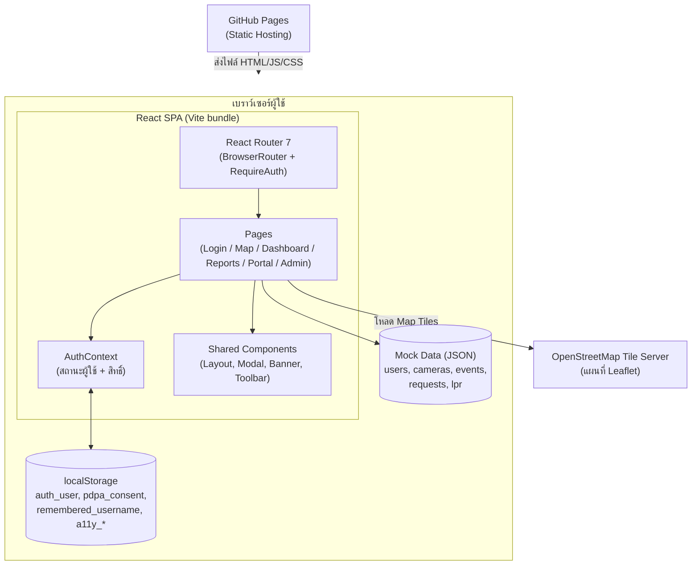
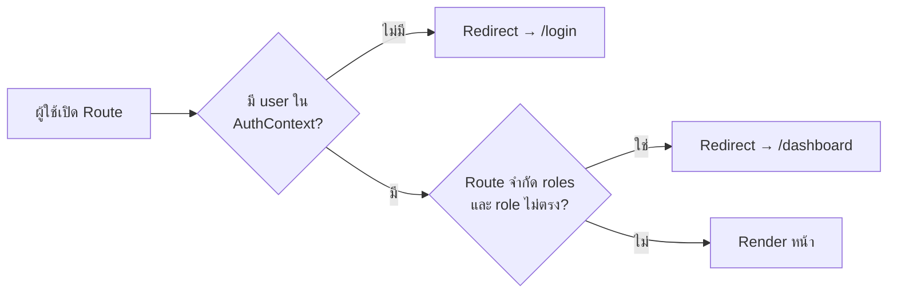
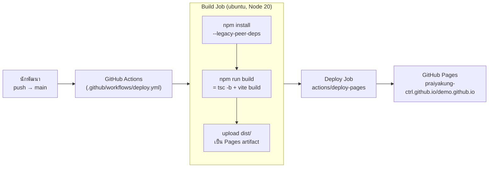

# สถาปัตยกรรมระบบ (System Architecture)

เอกสารสถาปัตยกรรมของ **ระบบฐานข้อมูลเพื่อการเข้าถึง (Data Integration and End Users)** — ระบบสาธิตการบริหารจัดการกล้อง CCTV องค์การบริหารส่วนจังหวัดชลบุรี

> เอกสารนี้อธิบายโครงสร้างเชิงเทคนิคสำหรับนักพัฒนา สำหรับภาพรวมการใช้งานและการติดตั้ง ดู [README.md](README.md)

---

## สารบัญ

- [1. ภาพรวมสถาปัตยกรรม](#1-ภาพรวมสถาปัตยกรรม)
- [2. สถาปัตยกรรมระดับสูง (High-level Architecture)](#2-สถาปัตยกรรมระดับสูง-high-level-architecture)
- [3. โครงสร้างเลเยอร์ของ Source Code](#3-โครงสร้างเลเยอร์ของ-source-code)
- [4. Routing และการควบคุมสิทธิ์ (Route Guard)](#4-routing-และการควบคุมสิทธิ์-route-guard)
- [5. การจัดการ State](#5-การจัดการ-state)
- [6. ชั้นข้อมูล (Data Layer)](#6-ชั้นข้อมูล-data-layer)
- [7. สถาปัตยกรรม UI Component](#7-สถาปัตยกรรม-ui-component)
- [8. ระบบ Styling และ Design Tokens](#8-ระบบ-styling-และ-design-tokens)
- [9. Cross-cutting Concerns](#9-cross-cutting-concerns)
- [10. Build และ Deployment Pipeline](#10-build-และ-deployment-pipeline)
- [11. ข้อจำกัดของระบบสาธิต และแนวทางต่อยอดสู่ Production](#11-ข้อจำกัดของระบบสาธิต-และแนวทางต่อยอดสู่-production)

---

## 1. ภาพรวมสถาปัตยกรรม

ระบบเป็น **Single Page Application (SPA)** ฝั่ง Client ทั้งหมด สร้างด้วย React 19 + TypeScript และ Build ด้วย Vite โดยออกแบบเป็นระบบสาธิต (Demo) ที่ **ไม่มี Backend** — ข้อมูลทั้งหมดมาจากไฟล์ JSON ที่ Bundle มากับตัวแอป และสถานะของผู้ใช้เก็บใน `localStorage` ของเบราว์เซอร์ ทำให้สามารถ Host เป็น Static Site บน GitHub Pages ได้โดยตรง

หลักการออกแบบสำคัญ:

| หลักการ | การนำไปใช้ |
|---|---|
| **Static-first** | ไม่มี Server-side dependency — Deploy เป็นไฟล์ static ล้วน |
| **Role-based Access Control** | ควบคุมสิทธิ์ 4 บทบาท (admin / operator / executive / citizen) ที่ระดับ Route |
| **Accessibility by design** | ทุก Dialog มี Focus trap, รองรับ WCAG (ปรับขนาดอักษร, คอนทราสต์สูง), ตรวจด้วย `eslint-plugin-jsx-a11y` |
| **Convention over configuration** | ใช้ Tailwind utility + shared component classes กลาง แทนการเขียน CSS แยกรายหน้า |

---

## 2. สถาปัตยกรรมระดับสูง (High-level Architecture)



- **บริการภายนอกเพียงอย่างเดียว** ที่ระบบเรียกขณะทำงานคือ OpenStreetMap tile server สำหรับแผนที่ Leaflet
- ไม่มีการเรียก REST API ใด ๆ — การ "เชื่อมโยงข้อมูล" (Data Integration) ในระบบสาธิตนี้จำลองผ่านไฟล์ JSON

---

## 3. โครงสร้างเลเยอร์ของ Source Code

```
src/
├── main.tsx          # Entry point — mount <App /> ใน StrictMode
├── App.tsx           # Routing, Route Guard (RequireAuth), โหลดค่า a11y
├── index.css         # Design tokens, shared classes, a11y overrides
│
├── pages/            # ── Presentation Layer (หนึ่งไฟล์ต่อหนึ่ง Route) ──
│   ├── LoginPage.tsx         #   /login — ยืนยันตัวตน + PDPA banner
│   ├── MapPage.tsx           #   /map — แผนที่ Leaflet + Live camera
│   ├── DashboardPage.tsx     #   /dashboard — กราฟ Recharts + สถิติ
│   ├── ReportsPage.tsx       #   /reports — export PDF/Excel
│   ├── CitizenPortalPage.tsx #   /portal — พอร์ทัลประชาชน
│   ├── CctvRequestPage.tsx   #   /portal/request — ฟอร์มขอข้อมูลภาพ
│   ├── AdminCamerasPage.tsx  #   /admin/cameras — CRUD กล้อง
│   └── AdminUsersPage.tsx    #   /admin/users — CRUD ผู้ใช้
│
├── components/       # ── Reusable UI Layer ──
│   ├── Layout.tsx            #   โครงหน้า: SkipLink + Navbar + Sidebar + <main>
│   ├── Navbar.tsx / Sidebar.tsx
│   ├── Modal.tsx             #   Modal + ConfirmDialog (ใช้ useDialog)
│   ├── PdpaConsentBanner.tsx #   แถบความยินยอม PDPA + Cookies Policy
│   ├── AccessibilityToolbar.tsx
│   ├── CameraClusterMarkers.tsx / LiveCameraModal.tsx
│   ├── CitizenPortalUI.tsx / Badge.tsx
│
├── context/          # ── Global State Layer ──
│   └── AuthContext.tsx       #   ผู้ใช้ปัจจุบัน + login/logout + สิทธิ์
│
├── hooks/            # ── Behavior Layer ──
│   └── useDialog.ts          #   Focus trap, Escape, focus restore
│
├── utils/            # ── Pure Utility Layer ──
│   ├── a11ySettings.ts       #   อ่าน/บันทึก/apply ค่า accessibility
│   ├── pdpaConsent.ts        #   อ่าน/บันทึกความยินยอม PDPA
│   ├── formatDate.ts / mapPin.ts / cameraDisplay.ts
│
├── data/             # ── Mock Data Layer (JSON) ──
│   ├── users.json / cameras.json / events.json
│   ├── requests.json / lpr.json
│
└── types/            # ── Type Definitions ──
    └── index.ts              #   Domain models + label/color constants
```

**กติกาการพึ่งพาระหว่างเลเยอร์** (บนพึ่งล่างได้ ล่างห้ามพึ่งบน):

```
pages → components → hooks / utils / types
pages → context → data / types
```

---

## 4. Routing และการควบคุมสิทธิ์ (Route Guard)

กำหนดทั้งหมดใน [src/App.tsx](src/App.tsx) โดยใช้ Component `RequireAuth` ครอบแต่ละ Route:

```tsx
<Route path="/admin/cameras" element={
  <RequireAuth roles={['admin']}>
    <AdminCamerasPage />
  </RequireAuth>
} />
```

ลำดับการตัดสินใจ:



- Route ที่ไม่ระบุ `roles` (เช่น `/portal`) อนุญาตทุกบทบาทที่ Login แล้ว
- `DefaultRedirect` (path `/`) ส่งผู้ใช้ไปหน้าแรกตามบทบาท: citizen → `/portal`, executive → `/dashboard`, อื่น ๆ → `/map`
- `BrowserRouter` ตั้ง `basename` จาก `import.meta.env.BASE_URL` เพื่อให้ตรงกับ `base: '/demo.github.io/'` ใน [vite.config.ts](vite.config.ts) (จำเป็นสำหรับ GitHub Pages)

---

## 5. การจัดการ State

ระบบใช้กลยุทธ์ State แบบเรียบง่าย ไม่ใช้ไลบรารีจัดการ State ภายนอก (ไม่มี Redux/Zustand):

| ประเภท State | กลไก | ตัวอย่าง |
|---|---|---|
| Global (ข้ามหน้า) | React Context — [AuthContext.tsx](src/context/AuthContext.tsx) | ผู้ใช้ปัจจุบัน, flag สิทธิ์ (`isAdmin`, `canEdit`, ...) |
| Local (ภายในหน้า/Component) | `useState` / `useEffect` | ฟอร์ม, การเปิด/ปิด Modal, ตัวกรองข้อมูล |
| Persistent (ข้าม Session) | `localStorage` | ตารางด้านล่าง |

### localStorage Keys

| Key | เขียนโดย | เนื้อหา |
|---|---|---|
| `auth_user` | [AuthContext.tsx](src/context/AuthContext.tsx) | ผู้ใช้ที่ Login (JSON `User`) — ทำให้ Refresh แล้วยังไม่หลุด |
| `remembered_username` | [LoginPage.tsx](src/pages/LoginPage.tsx) | ชื่อผู้ใช้เมื่อติ๊ก "จำฉันไว้" |
| `pdpa_consent` | [utils/pdpaConsent.ts](src/utils/pdpaConsent.ts) | `{"accepted": true, "date": "<ISO 8601>"}` |
| `a11y_font_scale` | [utils/a11ySettings.ts](src/utils/a11ySettings.ts) | ขนาดอักษร (100 / 112.5 / 125 %) |
| `a11y_high_contrast` | [utils/a11ySettings.ts](src/utils/a11ySettings.ts) | เปิด/ปิดโหมดคอนทราสต์สูง |

รูปแบบมาตรฐาน: อ่านค่าแบบ **lazy initializer** ใน `useState(() => ...)` เพื่ออ่าน localStorage เพียงครั้งเดียวตอน Mount และห่อ utility function ไว้ในไฟล์ `utils/` แทนการเรียก `localStorage` ตรง ๆ ในหลายที่

---

## 6. ชั้นข้อมูล (Data Layer)

ข้อมูลจำลองทั้งหมดเป็นไฟล์ JSON ใน `src/data/` — Vite import เข้ามาเป็น Module ตอน Build (Type-safe ผ่าน `as User[]` ฯลฯ):

| ไฟล์ | Domain Model ([src/types/index.ts](src/types/index.ts)) | ใช้โดย |
|---|---|---|
| `users.json` | `User` (4 บทบาท: `UserRole`) | AuthContext, AdminUsersPage |
| `cameras.json` | `Camera` (พิกัด, สถานะ, RTSP URL, เหตุการณ์ปัจจุบัน) | MapPage, AdminCamerasPage, Dashboard |
| `events.json` | `CctvEvent` (6 ประเภท: `EventType`) | MapPage, DashboardPage |
| `requests.json` | `CitizenRequest` + `TimelineEntry` (7 สถานะ: `RequestStatus`) | CitizenPortalPage, CctvRequestPage |
| `lpr.json` | `LprEntry`, `LprRoad` | DashboardPage |

ค่าคงที่สำหรับแสดงผล (label ภาษาไทย + สี) รวมศูนย์ที่ `types/index.ts`:
- `EVENT_LABELS` / `ROLE_LABELS` — ป้ายชื่อภาษาไทย
- `EVENT_COLORS` — สีพื้นหลัง/กราฟ
- `EVENT_TEXT_COLORS` — สีเข้มสำหรับตัวอักษรบนพื้นขาว (ผ่าน WCAG AA ≥ 4.5:1)

> การแก้ไขข้อมูล (CRUD ในหน้า Admin, การยื่นคำขอ) เกิดขึ้นใน React state ระหว่าง Session เท่านั้น — Refresh แล้วข้อมูลกลับสู่ค่าตั้งต้นจาก JSON

---

## 7. สถาปัตยกรรม UI Component

### โครงหน้า (Layout Shell)

ทุกหน้าหลังจาก Login ใช้ [Layout.tsx](src/components/Layout.tsx) ร่วมกัน:

```
┌──────────────────────────────────────────┐
│ SkipLink (ซ่อน — โผล่เมื่อกด Tab)          │
│ Navbar  (โลโก้ อบจ. + วันเวลา + ผู้ใช้)     │
├────────┬─────────────────────────────────┤
│Sidebar │  <main id="main-content">       │
│(เมนูตาม│   เนื้อหาของแต่ละ Page           │
│ บทบาท) │                                 │
└────────┴─────────────────────────────────┘
```

หน้า Login ไม่ใช้ Layout — เป็น Full-screen แยกต่างหาก

### ระบบ Dialog

Dialog ทุกตัวสร้างบนรากฐานเดียวกันคือ hook [useDialog](src/hooks/useDialog.ts) ซึ่งจัดการ Focus trap, ปิดด้วย Escape และคืนโฟกัสให้ปุ่มที่เปิด:

| Component | ใช้เมื่อ | ลักษณะพิเศษ |
|---|---|---|
| `Modal` | เนื้อหาทั่วไป (ฟอร์ม, รายละเอียด) | หัวสีกรมท่า + ไอคอน, ปิดได้ 3 ทาง (ปุ่ม X / Backdrop / Escape) |
| `ConfirmDialog` | ยืนยันการกระทำ (เช่น ลบข้อมูล) | `role="alertdialog"`, รองรับปุ่มอันตราย (`btn-danger`) |
| `PdpaConsentBanner` | ขอความยินยอม PDPA หน้า Login | แถบติดขอบล่าง **ปิดไม่ได้จนกว่าจะยอมรับ** + Modal นโยบายคุกกี้ |
| `LiveCameraModal` | แสดงภาพกล้องจำลอง | ต่อยอดจาก `Modal` |

---

## 8. ระบบ Styling และ Design Tokens

ใช้ **Tailwind CSS** เป็นหลัก โดยมีชั้นของ Convention ดังนี้ (ทั้งหมดอยู่ใน [src/index.css](src/index.css)):

1. **Design tokens** — สีหลักของแบรนด์คือกรมท่า `navy-700` (`#1B3A6B`) กำหนดใน [tailwind.config.js](tailwind.config.js), สี Accent สำหรับโฟกัสคือน้ำเงิน `#2563EB` และเหลืองอำพัน `#F59E0B`
2. **Shared component classes** — `.btn-primary`, `.btn-secondary`, `.btn-danger`, `.input-field`, `.label` ใช้ซ้ำทุกหน้าเพื่อความสม่ำเสมอ
3. **Utility classes ใน JSX** — รายละเอียด Layout เฉพาะจุดเขียนเป็น Tailwind utilities ตรง ๆ
4. **Mode overrides** — คลาส `html.high-contrast` override สีทั้งระบบสำหรับโหมดคอนทราสต์สูง และ media query `prefers-reduced-motion` ปิด Animation

ฟอนต์หลัก: TH Sarabun New / Noto Sans Thai (โหลดใน [index.html](index.html))

---

## 9. Cross-cutting Concerns

### การเข้าถึง (Accessibility / WCAG)

กลไกที่ทำงานทั่วทั้งระบบ:

- `loadA11ySettings()` ถูกเรียกครั้งเดียวใน `App` ก่อน Render หน้าใด ๆ — apply ขนาดอักษรและคอนทราสต์ที่บันทึกไว้ลงบน `<html>` (rem-based ทั้งระบบจึง Scale ตาม)
- `AccessibilityToolbar` แสดงทุกหน้า (มุมขวาบน) ให้ปรับค่าได้ตลอดเวลา
- `useDialog` บังคับมาตรฐาน Dialog เดียวกันทุกที่
- ESLint บังคับกฎ `jsx-a11y` ตั้งแต่เวลาพัฒนา

### การคุ้มครองข้อมูลส่วนบุคคล (PDPA)

- `PdpaConsentBanner` แสดงที่หน้า Login เมื่อยังไม่มีความยินยอมใน `localStorage`
- ตรรกะการอ่าน/เขียนแยกไว้ที่ [utils/pdpaConsent.ts](src/utils/pdpaConsent.ts) เพื่อให้หน้าอื่นตรวจสอบความยินยอมได้ในอนาคต

---

## 10. Build และ Deployment Pipeline



จุดที่ต้องรู้:

- `npm run build` รัน **TypeScript type-check (`tsc -b`) ก่อนเสมอ** — Type error ทำให้ Build fail
- ค่า `base: '/demo.github.io/'` ใน `vite.config.ts` ต้องตรงกับชื่อ Repository และถูกส่งต่อไปเป็น `basename` ของ Router โดยอัตโนมัติผ่าน `import.meta.env.BASE_URL`
- ไฟล์ Static (โลโก้, ภาพพื้นหลัง) อ้างอิงผ่าน `import.meta.env.BASE_URL` เช่นกัน เพื่อให้ทำงานได้ทั้ง local และ Pages
- **SPA Deep-link Fallback** — GitHub Pages ไม่รู้จัก Route ฝั่ง Client ดังนั้น [public/404.html](public/404.html) จะรับทุก path ที่ไม่มีไฟล์จริง แล้ว Redirect กลับ root พร้อมเข้ารหัส path เดิมไว้ใน query string (`/map` → `/?/map`) จากนั้น script ใน [index.html](index.html) ถอดรหัสคืนด้วย `history.replaceState` ก่อน React โหลด (เทคนิค [spa-github-pages](https://github.com/rafgraph/spa-github-pages))

---

## 11. ข้อจำกัดของระบบสาธิต และแนวทางต่อยอดสู่ Production

ข้อจำกัดโดยเจตนาของ Demo และสิ่งที่ต้องเปลี่ยนเมื่อพัฒนาเป็นระบบจริง:

| ด้าน | สถานะปัจจุบัน (Demo) | แนวทาง Production |
|---|---|---|
| ข้อมูล | JSON bundle + state ใน Memory (หายเมื่อ Refresh) | Backend API + ฐานข้อมูล (เช่น PostgreSQL) |
| การยืนยันตัวตน | เทียบรหัสผ่าน plaintext ใน `users.json` ฝั่ง Client | ระบบ Auth ฝั่ง Server (OAuth2/OIDC, JWT, Session) — **ห้ามใช้รูปแบบปัจจุบันกับข้อมูลจริงเด็ดขาด** |
| Login ด้วย Google | จำลอง (สร้าง user citizen ทันที) | Google OAuth จริง |
| ภาพกล้อง Live | ภาพนิ่งจำลอง | Streaming gateway (เช่น RTSP → HLS/WebRTC) |
| ความยินยอม PDPA | เก็บใน localStorage รายเบราว์เซอร์ | บันทึกฝั่ง Server ผูกกับบัญชีผู้ใช้ พร้อม Audit log |
| การแจ้งเตือนเหตุการณ์ | ข้อมูลนิ่งจาก JSON | WebSocket / Server-Sent Events จากระบบวิเคราะห์ภาพ |
| ขนาด Bundle | Single chunk (~980 kB min) | Code splitting ราย Route (`React.lazy`) |
