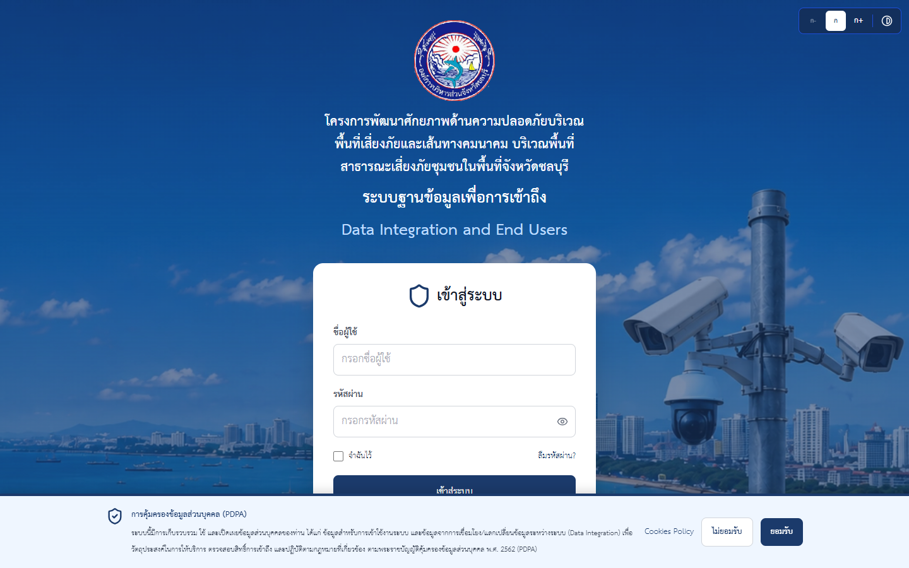
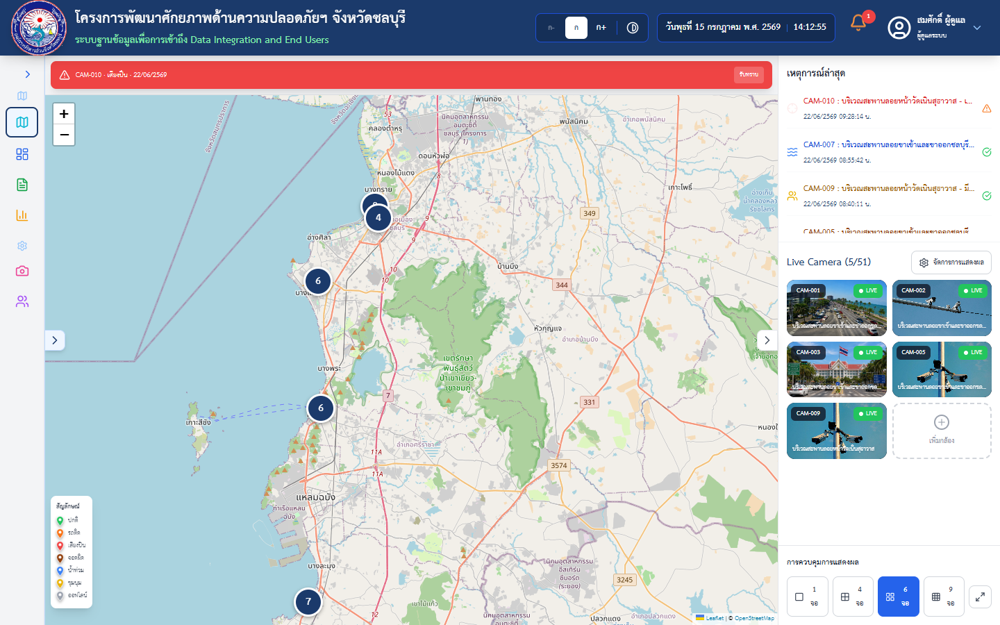
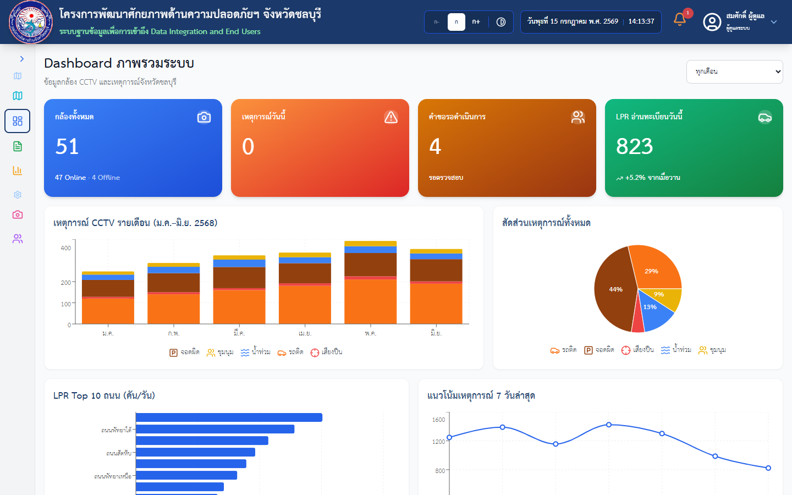

# ระบบฐานข้อมูลเพื่อการเข้าถึง (Data Integration and End Users)

ระบบสาธิต (Demo) ภายใต้ **โครงการพัฒนาศักยภาพด้านความปลอดภัยบริเวณพื้นที่เสี่ยงภัยและเส้นทางคมนาคม บริเวณพื้นที่สาธารณะเสี่ยงภัยชุมชนในพื้นที่จังหวัดชลบุรี** — องค์การบริหารส่วนจังหวัดชลบุรี

เว็บแอปพลิเคชันสำหรับบริหารจัดการข้อมูลกล้องโทรทัศน์วงจรปิด (CCTV) แผนที่จุดติดตั้ง แดชบอร์ดสรุปผล ระบบรายงาน และพอร์ทัลบริการประชาชนสำหรับขอข้อมูลภาพจากกล้อง

[](https://react.dev)
[](https://www.typescriptlang.org)
[](https://vite.dev)
[](https://tailwindcss.com)
[](https://praiyakung-ctrl.github.io/demo.github.io/)

🔗 **Live Demo:** <https://praiyakung-ctrl.github.io/demo.github.io/>
📐 **เอกสารสถาปัตยกรรมระบบ:** [ARCHITECTURE.md](ARCHITECTURE.md)

---

## สารบัญ

- [ภาพหน้าจอ (Screenshots)](#ภาพหน้าจอ-screenshots)
- [คุณสมบัติหลัก (Features)](#คุณสมบัติหลัก-features)
- [เทคโนโลยีที่ใช้ (Tech Stack)](#เทคโนโลยีที่ใช้-tech-stack)
- [การติดตั้งและใช้งาน (Getting Started)](#การติดตั้งและใช้งาน-getting-started)
- [บัญชีทดสอบ (Demo Accounts)](#บัญชีทดสอบ-demo-accounts)
- [บทบาทและสิทธิ์การเข้าถึง (Roles & Routes)](#บทบาทและสิทธิ์การเข้าถึง-roles--routes)
- [โครงสร้างโปรเจกต์ (Project Structure)](#โครงสร้างโปรเจกต์-project-structure)
- [การรองรับการเข้าถึง (Accessibility / WCAG)](#การรองรับการเข้าถึง-accessibility--wcag)
- [การคุ้มครองข้อมูลส่วนบุคคล (PDPA)](#การคุ้มครองข้อมูลส่วนบุคคล-pdpa)
- [การ Deploy](#การ-deploy)

---

## ภาพหน้าจอ (Screenshots)

### หน้าเข้าสู่ระบบ (Login) พร้อมแถบขอความยินยอม PDPA


### แผนที่กล้อง CCTV (Map)


### แดชบอร์ดภาพรวมระบบ (Dashboard)


---

## คุณสมบัติหลัก (Features)

### 🔐 ระบบยืนยันตัวตน (Authentication)
- เข้าสู่ระบบด้วยชื่อผู้ใช้/รหัสผ่าน แยกสิทธิ์ตามบทบาท (Role-based Access Control)
- เข้าสู่ระบบด้วย Google สำหรับประชาชน (จำลอง)
- จำฉันไว้ (Remember Me) และลืมรหัสผ่าน (Forgot Password)
- แถบขอความยินยอม PDPA พร้อมนโยบายคุกกี้ (Cookies Policy)

### 🗺️ แผนที่กล้อง CCTV (Map)
- แผนที่แบบ Interactive ด้วย Leaflet แสดงจุดติดตั้งกล้องทั่วจังหวัดชลบุรี
- จัดกลุ่มหมุดกล้อง (Marker Clustering) และดูภาพกล้องแบบ Live (จำลอง)

### 📊 แดชบอร์ดผู้บริหาร (Dashboard)
- สรุปสถานะกล้อง เหตุการณ์ และสถิติด้วยกราฟ (Recharts)
- ข้อมูลป้ายทะเบียนรถ (LPR — License Plate Recognition)

### 🧾 ระบบรายงาน (Reports)
- ออกรายงานสรุปผล พร้อมส่งออกเป็น **PDF** (jsPDF + html2canvas) และ **Excel** (SheetJS)

### 🏛️ พอร์ทัลประชาชน (Citizen Portal)
- ยื่นคำขอข้อมูลภาพจากกล้อง CCTV ออนไลน์ พร้อมติดตามสถานะคำขอ

### ⚙️ ระบบผู้ดูแล (Admin)
- จัดการข้อมูลกล้อง (เพิ่ม/แก้ไข/ลบ) และจัดการผู้ใช้งานระบบ

---

## เทคโนโลยีที่ใช้ (Tech Stack)

| ด้าน | เทคโนโลยี |
|---|---|
| Frontend Framework | [React 19](https://react.dev) + [TypeScript](https://www.typescriptlang.org) |
| Build Tool | [Vite 8](https://vite.dev) |
| Styling | [Tailwind CSS 3.4](https://tailwindcss.com) |
| Routing | [React Router 7](https://reactrouter.com) |
| แผนที่ | [Leaflet](https://leafletjs.com) + [React Leaflet](https://react-leaflet.js.org) |
| กราฟ/Chart | [Recharts](https://recharts.org) |
| ไอคอน | [Lucide React](https://lucide.dev) |
| Export | [jsPDF](https://github.com/parallax/jsPDF), [html2canvas](https://html2canvas.hertzen.com), [SheetJS (xlsx)](https://sheetjs.com) |
| Lint | ESLint + typescript-eslint + `eslint-plugin-jsx-a11y` |
| CI/CD | GitHub Actions → GitHub Pages |

> **หมายเหตุ:** ระบบนี้เป็น Demo — ข้อมูลทั้งหมด (ผู้ใช้ กล้อง เหตุการณ์ คำขอ) เป็นข้อมูลจำลองจากไฟล์ JSON ใน `src/data/` และสถานะต่าง ๆ เก็บใน `localStorage` ของเบราว์เซอร์ ไม่มี Backend จริง

---

## การติดตั้งและใช้งาน (Getting Started)

### ความต้องการของระบบ
- [Node.js](https://nodejs.org) เวอร์ชัน 20 ขึ้นไป
- npm

### ขั้นตอนติดตั้ง

```bash
# 1. Clone โปรเจกต์
git clone <repository-url>
cd Demo

# 2. ติดตั้ง dependencies
npm install --legacy-peer-deps

# 3. รันในโหมดพัฒนา (Development)
npm run dev
```

เปิดเบราว์เซอร์ที่ `http://localhost:5173/demo.github.io/`

### คำสั่งที่ใช้บ่อย

| คำสั่ง | คำอธิบาย |
|---|---|
| `npm run dev` | รัน Development Server พร้อม Hot Reload |
| `npm run build` | ตรวจสอบ TypeScript และ Build สำหรับ Production (ผลลัพธ์ที่ `dist/`) |
| `npm run preview` | ทดสอบไฟล์ที่ Build แล้วในเครื่อง |
| `npm run lint` | ตรวจสอบคุณภาพโค้ดด้วย ESLint |
| `npm test` | รัน Unit test ด้วย Vitest |

---

## บัญชีทดสอบ (Demo Accounts)

| บทบาท | Username | Password |
|---|---|---|
| ผู้ดูแลระบบ (Admin) | `admin` | `admin1234` |
| เจ้าหน้าที่ (Operator) | `operator` | `oper1234` |
| ผู้บริหาร (Executive) | `executive` | `exec1234` |
| ประชาชน (Citizen) | — | กดปุ่ม "เข้าสู่ระบบด้วย Google" |

---

## บทบาทและสิทธิ์การเข้าถึง (Roles & Routes)

| เส้นทาง (Route) | หน้า | Admin | Operator | Executive | Citizen |
|---|---|:---:|:---:|:---:|:---:|
| `/login` | เข้าสู่ระบบ | ✅ | ✅ | ✅ | ✅ |
| `/register` | สมัครสมาชิกประชาชน (Google OAuth) | ✅ | ✅ | ✅ | ✅ |
| `/map` | แผนที่กล้อง CCTV | ✅ | ✅ | ✅ | — |
| `/dashboard` | แดชบอร์ด | ✅ | ✅ | ✅ | — |
| `/reports` | รายงาน | ✅ | ✅ | ✅ | — |
| `/portal` | พอร์ทัลประชาชน | ✅ | ✅ | ✅ | ✅ |
| `/portal/request` | ยื่นคำขอข้อมูลภาพ CCTV | ✅ | ✅ | ✅ | ✅ |
| `/admin/cameras` | จัดการกล้อง | ✅ | — | — | — |
| `/admin/users` | จัดการผู้ใช้งาน | ✅ | — | — | — |
| `/admin/repairs` | กล้องรอตรวจสอบ (แจ้งซ่อม) | ✅ | — | — | — |

การแก้ไขข้อมูล (เพิ่ม/แก้ไข/ลบ) ทำได้เฉพาะบทบาท Admin และ Operator

---

## โครงสร้างโปรเจกต์ (Project Structure)

```
Demo/
├── .github/workflows/
│   └── deploy.yml            # GitHub Actions — Build & Deploy อัตโนมัติ
├── public/                   # ไฟล์ Static (โลโก้, ภาพพื้นหลัง)
├── src/
│   ├── components/           # UI Components ที่ใช้ร่วมกัน
│   │   ├── Modal.tsx             # Modal / ConfirmDialog (รองรับ a11y)
│   │   ├── PdpaConsentBanner.tsx # แถบขอความยินยอม PDPA + Cookies Policy
│   │   ├── AccessibilityToolbar.tsx # ปรับขนาดตัวอักษร / โหมดคอนทราสต์สูง
│   │   ├── Layout.tsx / Navbar.tsx / Sidebar.tsx
│   │   ├── CameraClusterMarkers.tsx / LiveCameraModal.tsx
│   │   └── ...
│   ├── context/
│   │   └── AuthContext.tsx   # จัดการสถานะการเข้าสู่ระบบและสิทธิ์
│   ├── data/                 # ข้อมูลจำลอง (users, cameras, events, requests, lpr)
│   ├── hooks/
│   │   └── useDialog.ts      # Focus trap + Escape + Focus restore สำหรับ Dialog
│   ├── pages/                # หน้าหลักของระบบ (Login, Map, Dashboard, ฯลฯ)
│   ├── types/                # TypeScript Type Definitions
│   ├── utils/                # Utility functions (a11y, PDPA consent, date, ฯลฯ)
│   ├── App.tsx               # Routing และ Route Guard (RequireAuth)
│   └── main.tsx              # Entry point
├── index.html
├── tailwind.config.js
├── vite.config.ts            # base: /demo.github.io/ สำหรับ GitHub Pages
└── package.json
```

---

## การรองรับการเข้าถึง (Accessibility / WCAG)

ระบบออกแบบโดยคำนึงถึงแนวทาง WCAG:

- **Accessibility Toolbar** — ปรับขนาดตัวอักษรและเปิดโหมดคอนทราสต์สูง (บันทึกค่าใน `localStorage`)
- **Keyboard Navigation** — Dialog ทุกตัวมี Focus Trap, ปิดด้วย Escape และคืนโฟกัสให้ปุ่มที่เปิด (ผ่าน hook `useDialog`)
- **Screen Reader** — ใช้ `role="dialog"` / `alertdialog"`, `aria-modal`, `aria-labelledby`, `role="alert"` สำหรับข้อความแจ้งเตือน
- **อื่น ๆ** — Skip Link, `:focus-visible` outline, รองรับ `prefers-reduced-motion` และตรวจสอบด้วย `eslint-plugin-jsx-a11y`

---

## การคุ้มครองข้อมูลส่วนบุคคล (PDPA)

เมื่อเข้าหน้า Login ครั้งแรก ระบบจะแสดงแถบขอความยินยอมด้านล่างของหน้าจอ ตาม**พระราชบัญญัติคุ้มครองข้อมูลส่วนบุคคล พ.ศ. 2562 (PDPA)** ประกอบด้วยปุ่ม **ยอมรับ** / **ไม่ยอมรับ** และ **Cookies Policy** (แสดงรายละเอียดนโยบายคุกกี้)

- เมื่อกดยอมรับ ระบบบันทึกความยินยอมไว้ที่ `localStorage` key `pdpa_consent` ในรูปแบบ `{"accepted": true, "date": "<ISO 8601>"}`
- หากยังไม่ยอมรับ ระบบจะแสดงข้อความแจ้งว่าจำเป็นต้องยอมรับก่อนใช้งาน
- ทดสอบซ้ำได้โดยรัน `localStorage.removeItem('pdpa_consent')` ใน DevTools Console แล้ว Reload

---

## การ Deploy

ระบบ Deploy อัตโนมัติไปยัง **GitHub Pages** ผ่าน GitHub Actions (`.github/workflows/deploy.yml`):

1. Push ไปยัง branch `main`
2. Workflow จะติดตั้ง dependencies → `npm run build` → อัปโหลด `dist/` ไปยัง GitHub Pages

> หาก Fork หรือย้าย Repository ให้แก้ค่า `base` ใน [vite.config.ts](vite.config.ts) ให้ตรงกับชื่อ Repository ใหม่

---

## License

สงวนลิขสิทธิ์ © 2026 องค์การบริหารส่วนจังหวัดชลบุรี — จัดทำเพื่อการสาธิต (Demonstration) เท่านั้น ห้ามนำไปใช้ ทำซ้ำ หรือเผยแพร่โดยไม่ได้รับอนุญาตเป็นลายลักษณ์อักษร ดูรายละเอียดใน [LICENSE](LICENSE)
